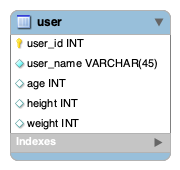

# EngineersGate SQLオリジナル課題
***

SQLオリジナル課題制作物になります。

### 目的
***

SQLオリジナル課題制作物として、下記課題を行いました。

### 1.MySQLをインストールしましょう

### 2.MySQLに接続してみましょう

### 3.データベースを作成しましょう
```
/* 3.データベース作成 */
CREATE DATABASE test_id;
```
### 4.テーブルを作成しましょう
```
/* 4.テーブルを作成 */
CREATE TABLE test_id.user (
user_id INT AUTO_INCREMENT NOT NULL PRIMARY KEY,
user_name VARCHAR(45) NOT NULL COMMENT '名前',
age INT NULL COMMENT '年齢',
height INT NULL COMMENT '身長',
weight INT NULL COMMENT '体重');

```

### 5.作成したテーブルにレコードの登録・更新・削除をおこなってみましょう
```
/* 5.レコードの登録・更新・削除 */
INSERT INTO user(user_name, age, height, weight)
VALUES ('山田 太郎', 20, 170, 70),
('佐藤 太郎', 20, 170, 70),
('中原 太郎', 20, 170, 80),
('田中 太郎', 20, 170, 80);

UPDATE user SET user_name = '山田 二郎' WHERE user_id = 1;
UPDATE user SET weight = 90 WHERE user_id = 3;

 DELETE FROM user WHERE user_id = 4;

```
### 6.MySQL Workbenchをインストールしましょう

### 7.MySQL Workbenchで、作成したデータベースに接続しましょう

### 8.MySQL Workbenchで、ER図を作成してみましょう

